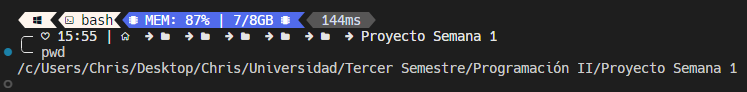
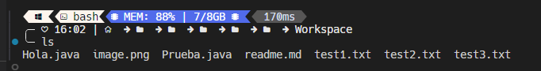
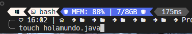
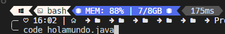
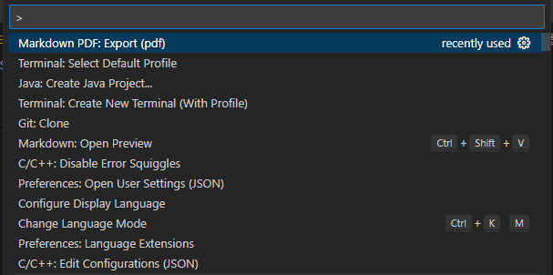
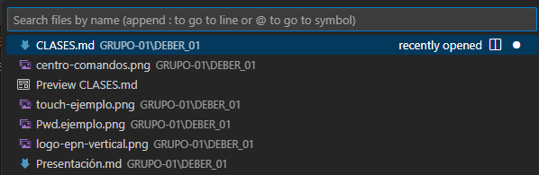
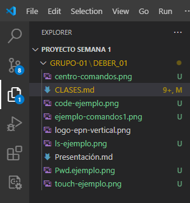
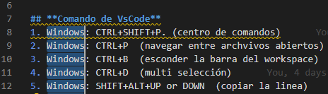
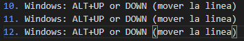

# TAREA 01
# 
**ESCUELA POLITECNICA NACIONAL**

### 
**Facultad de Ingenieria en Sistemas**

### 
**Ingenieria en Computacion**

### 
Programacion II

 
 

  

 
 

### Integrantes:

- Angulo Jairo
- Bedon Joan
- Caicedo Camila
- Condoy Estefano
- Criollo Christopher 

## CLASE 01     29/04/2024
# **INTRODUCCION**
En nuestro primer encuentro, tuvimos la oportunidad de conocernos entre compañeros y establecer las bases de nuestro aprendizaje. El tutor, con su vasta experiencia y sabiduría, nos brindó pautas claves que servirán como brújula en nuestro camino de crecimiento intelectual.
A continuación, detallo dichas pautas con la solemnidad que ameritan:

### **DATOS GENERALES**
**Dias de Clase:** Lunes-Martes-Miercoles

**Horas de clases:** De 11:00 a 13:00

**Puntualidad:** Hasta 10 min tarde

**Tutor:** Patricio Paccha *(Pat Mic)*.
### **RECURSOS TRABAJO GRUPAL**
- Marcadores de pizarra *(rojo,azul,negro)*
- Hojas de papel bond
- Pc o celulares
- Notitas adhesivas
- Taza de café
- "No trompud@s - No brav@s - No chukis"
### **SISTEMA DE EVALUACIÓN**

| EVALUACIÓN   |   PUNTAJE    | TEMPORALIDAD |
|--------------|:------------:|-------------:|
| Prueba       |     25%      |    Mensual   |
| Examén       |     25%      |   Bimestral  |
| Workshop     |     10%      |   Mensual    |
| Homework     |     10%      |   Mensual    |
| Proyecto     |     30%      |   Bimestral  |
| Actuación    |   + 0.1      |   Siempre    |
| Retos        |    +1.0      |   Siempre    |

## CLASE 02     30/04/2024
### Comandos de Linux
Dentro de clase se checaron 4 comandos importantes que fueron los siguientes:
1. pwd: 
   
   **comando utilizado para ver la localización en la cual se encuentra el repositorio**
2. ls:
   
**lista el contenido que se encuentre en el directorio**
3. touch (*nombre del archivo que quiera crear mas el punto*):
 
4. code (*archivo que quiera abrir*)
 
### Comandos de VsCode
En la clase se vieron varios comandos resaltando principalmente 10 de ellos.
1.  Windows: CTRL+SHIFT+P. (centro de comandos)

2. Windows: CTRL+P  (navegar entre archvivos abiertos)

3. Windows: CTRL+B  (esconder la barra del workspace)

4. Windows: CTRL+D  (multi selección)

5. Windows: SHIFT+ALT+UP or DOWN  (copiar la linea arriba o abajo)

## CLASE 03     01/05/2024