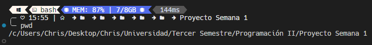
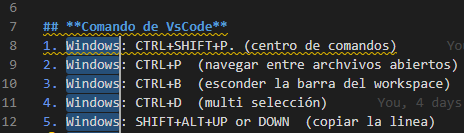
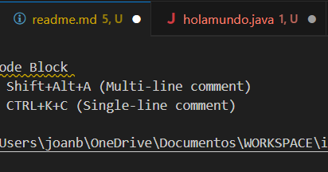

# TAREA 01
# <div align="center">**ESCUELA POLITECNICA NACIONAL**</div>
### <div align="center">**Facultad de Ingenieria en Sistemas**</div>
### <div align="center">**Ingenieria en Computacion**</div>
### <div align="center">Programacion II</div>

<br>
<br>
<p align="center">
  
</p>
</br>
</br>

### Integrantes:

- Angulo Jairo
- Bedon Joan
- Caicedo Camila
- Condoy Estefano
- Criollo Christopher 

<div style="page-break-after: always;"></div>

## CLASE 01     29/04/2024
# **INTRODUCCION**
En nuestro primer encuentro, tuvimos la oportunidad de conocernos entre compañeros y establecer las bases de nuestro aprendizaje. El tutor, con su vasta experiencia y sabiduría, nos brindó pautas claves que servirán como brújula en nuestro camino de crecimiento intelectual.
A continuación, detallo dichas pautas con la solemnidad que ameritan:

### **DATOS GENERALES**
**Dias de Clase:** Lunes-Martes-Miercoles

**Horas de clases:** De 11:00 a 13:00

**Puntualidad:** Hasta 10 min tarde

**Tutor:** Patricio Paccha *(Pat Mic)*.
### **RECURSOS TRABAJO GRUPAL**
- Marcadores de pizarra *(rojo,azul,negro)*
- Hojas de papel bond
- Pc o celulares
- Notitas adhesivas
- Taza de café
- "No trompud@s - No brav@s - No chukis"
### **SISTEMA DE EVALUACIÓN**
<center>

| EVALUACIÓN   |   PUNTAJE    | TEMPORALIDAD |
|--------------|:------------:|-------------:|
| Prueba       |     25%      |    Mensual   |
| Examén       |     25%      |   Bimestral  |
| Workshop     |     10%      |   Mensual    |
| Homework     |     10%      |   Mensual    |
| Proyecto     |     30%      |   Bimestral  |
| Actuación    |   + 0.1      |   Siempre    |
| Retos        |    +1.0      |   Bimestral  |
</center>

## CLASE 02     30/04/2024
### Comandos de Linux
Dentro de clase se checaron 4 comandos importantes que fueron los siguientes:
1. pwd: 
 - 
**comando utilizado para ver la localización en la cual se encuentra el repositorio**
2. ls:
-  
**lista el contenido que se encuentre en el directorio**
3. touch (*nombre del archivo que quiera crear mas el punto*):
-   
4. code (*archivo que quiera abrir*)
-   
### Comandos de VsCode
En la clase se vieron varios comandos resaltando principalmente 10 de ellos.
1.  Windows: CTRL+SHIFT+P. (centro de comandos)
- 
2. Windows: CTRL+P  (navegar entre archvivos abiertos)
- 
3. Windows: CTRL+B  (esconder la barra del workspace)
- 
4. Windows: CTRL+D  (multi selección)
- 
5. Windows: SHIFT+ALT+UP or DOWN  (copiar la linea arriba o abajo)
- 
6. Comentar en el Code Block
   
**Windows:** Shift+Alt+A (Multi-line comment)
             CTRL+K+C (Single-line comment)


7. Regresar / Ir Adelante

**Windows:** Alt+-> o + <-




8. Mostrar todos los Symbolos 
   
**Windows:** CTRL+T


9. Encender ayuda y encender los parametros hints
   
**Windows:** CTRL+Space, CTRL+Shift+Space


## CLASE 03     01/05/2024
___

## MARKDOWN

Permite agregar formato a documentos de texto plano y crear contenido de una manera sencilla de escribir mostrando un diseño legible al momento de tomar apuntes de clase.

## SINTAXIS

- Para colocar un texto en cursiva, se usa un * antes y después del texto. Ejemplo:


*Hola mundo*

- Para un texto en negrita, se utilizan ** antes y después del texto. Ejemplo:


  
**Hola mundo**

- Para un texto en negrita y cursiva, se usan *** antes y después del texto. Ejemplo:
- 


***Hola mundo***

- Para representar un texto tachado se escribe dos virgulillas seguidas antes y después del texto. Ejemplo:


  

~~Hola Mundo~~ 

- Para crear un título se utiliza un # antes del texto, separada por un espacio en blanco. Para crear subtítulos se insertan más #. Ejemplo:

# Título 1
## Título 2
### Título 3


- Para marcar un área de texto como código, se pone un acento al principio y otro al final del texto para delimitarla. Para iniciar y finalizar los bloques de código, se puede marcar el área correspondiente insertando tres acentos graves al principio y al final. Ejemplo:
  

  
  
  ```java
  public class Hola {
    public static void main(String[] args) {
        System.out.println();
    }
}
```

- Para insertar un URL o una dirección de correo electrónico:


[buscador google](http://google.com)

- Para insertar una imagen:


- Para insertar tablas:
  


|Columna 1|Columna 2|
|--------|--------|
|    A    |    B    |
|    C    |    D    |

<div style="float: left; margin-right: 50px;">
    <h1>GIT</h1>
</div>


- Herramienta para facilitar el trabajo colaborativo.

## Comandos

</div>


## Trabajo Local y Colaborativo

Git es una herramienta de control de versiones distribuido, lo que significa que cada colaborador tiene una copia local del repositorio completo. Esto facilita el trabajo tanto individual como colaborativo

### Trabajo Local

- **Inicio del Proyecto**: Con `git init`, se inicia un nuevo repositorio Git en el directorio local del proyecto.
- **Desarrollo de Funcionalidades**: Se crean nuevas ramas (`git branch`) para desarrollar nuevas funcionalidades sin afectar la rama principal (generalmente `master` o `main`).
- **Guardar Cambios**: Con `git add` y `git commit`, se guardan los cambios en el repositorio local a medida que se avanza en el desarrollo.
- **Revisión de Historial**: Utilizando `git log` y `git diff`, se revisa el historial de cambios y se comparan las diferencias entre versiones.
- **Revertir Cambios**: Se pueden revertir cambios utilizando `git reset` o `git checkout`.

### Trabajo Colaborativo

- **Clonar el Repositorio**: Los colaboradores clonan el repositorio remoto con `git clone`.
- **Desarrollar en Ramas**: Cada colaborador puede trabajar en su propia rama y luego fusionar los cambios con `git merge`.
- **Comunicación**: Los cambios se comparten a través del repositorio remoto y se pueden revisar con `git pull`.
- **Resolución de Conflictos**: Si hay conflictos entre los cambios de diferentes colaboradores, se resuelven manualmente antes de fusionar las ramas.
- **Subir Cambios**: Los cambios se suben al repositorio remoto con `git push`, lo que permite que otros colaboradores vean y revisen los cambios.
